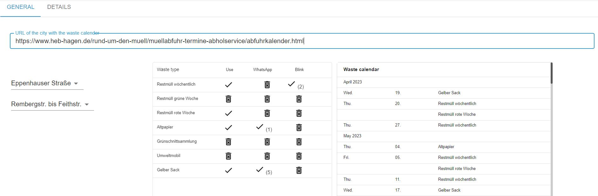
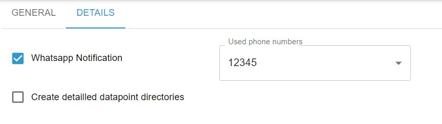
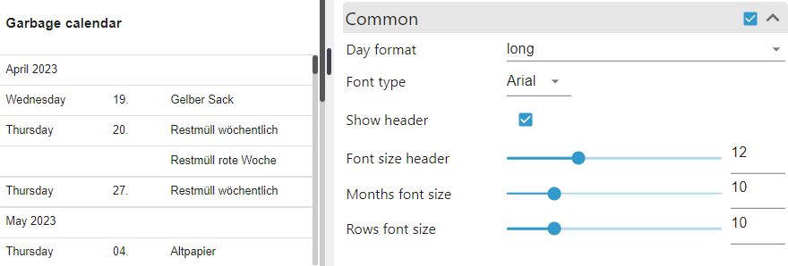
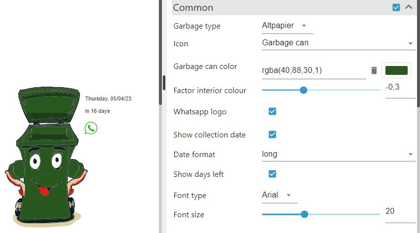
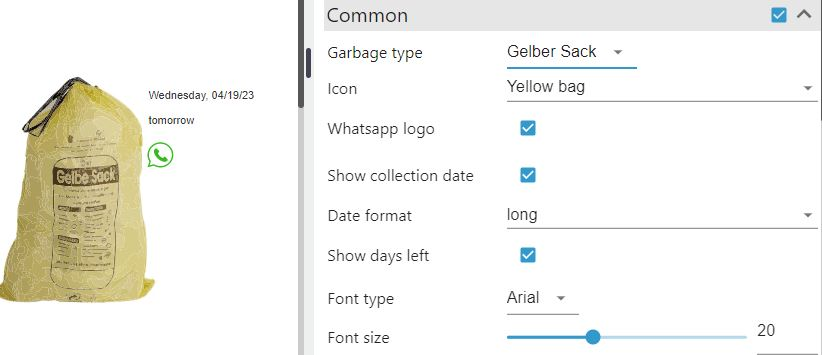
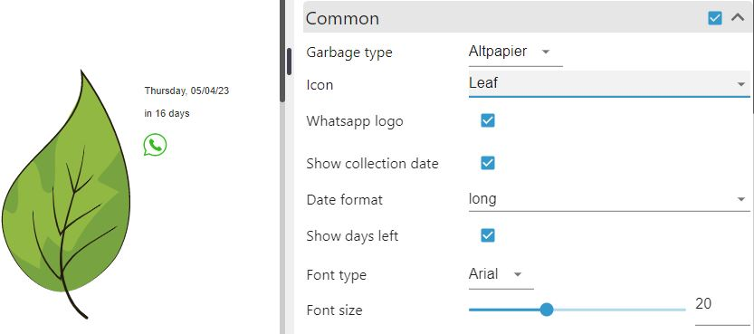
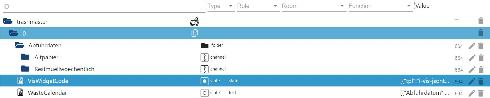
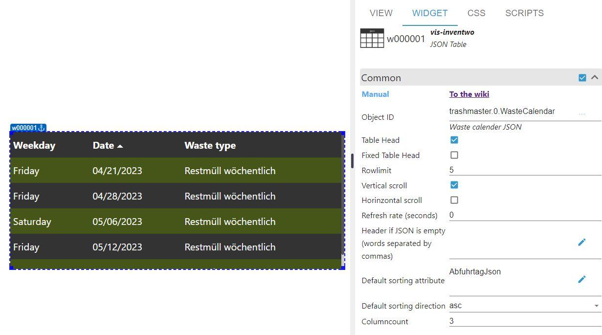
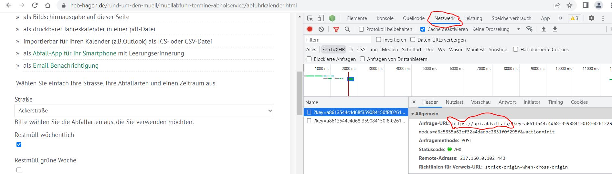

# ioBroker.trashmaster

## Waste calendar for ioBroker

[German version](./docs/de/README.md)

The adapter reads the garbage collection dates of the provider abfall.io, which various cities or counties use (e.g. [Hagen](https://www.heb-hagen.de/rund-um-den-muell/muellabfuhr-termine-abholservice/abfuhrkalender.html), [Ludwigshafen](https://www.ludwigshafen.de/wirtschaftsstark/wirtschaftsbetrieb-ludwigshafen-wbl/abfall-und-wertstoffe/abfall-und-wertstoffkalender-online) or [Landkreis Tuttlingen](https://www.abfall-tuttlingen.de/Abfalltermine-APP/)). The individual types of waste in the city can be selected and displayed in a calendar, for example. 

If the [Whatsapp Adapter]( https://github.com/ioBroker/ioBroker.whatsapp-cmb) is installed in ioBroker, automatic sending of messages before collection is supported per waste type. The number of days to send the message before collection can be set individually for each waste type.

The adapter contains two widgets for the [VIS 2 (!)](https://www.npmjs.com/package/iobroker.vis-2-beta?activeTab=readme). A calendar with the configured waste types or an icon with different configuration options can be displayed. The icon can start flashing x days before collection if that is configured in the adapter settings for the waste type

If [VIS](https://github.com/ioBroker/ioBroker.vis) or [VIS 2 (!)](https://www.npmjs.com/package/iobroker.vis-2-beta?activeTab=readme) AND the [inventwo](https://github.com/inventwo/ioBroker.vis-inventwo) widget set are installed, a datapoint containing the widget code for a JSON table is created.If [VIS](https://github.com/ioBroker/ioBroker.vis) or [VIS 2 (!)](https://www.npmjs.com/package/iobroker.vis-2-beta?activeTab=readme) AND the [inventwo](https://github.com/inventwo/ioBroker.vis-inventwo) widget set are installed, a datapoint containing the widget code for a JSON table is created.

**_General adapter settings:_**

**_Detailed settings:_**

**_Examples widgets:_** 

- *Calendar*

- *Icon (garbage can)*

- *Icon (yellow bag)*

- *Icon (leaf)*

+ *VIS inventwo widget (JSON table)*
>- *Data point with code for VIS inventwo widget (JSON table)*

>- *VIS inventwo widget (JSON table with data from the waste calendar)*

**_Does my city/county qualify for the adapter?:_**

Cities/counties that cooperate with abfall.io. offer similar calendars on their websites, as you can see e.g. on the page of [HEB Hagen](https://www.heb-hagen.de/rund-um-den-muell/). If the URL of your waste management company is not accepted by the adapter, you can check on the waste management company page with the developer tool of your browser, if a URL with api.abfall.io (not apiv2.abfall.io !) is called when selecting the city, street. Here is an example from the Chrome developer tool (callable via function key F12 - then select network there and reload the page).

**_Other:_**

+  The adapter is restarted every night around 0:05 (+ some random delay in order not to stress the API by too many parallel calls), reads the data from the API of abfall.io and updates the corresponding data points in the object dictionary of the adapter instance. Since a waste calendar usually does not change frequently, this interval should be perfectly sufficient. However, you can change the setting at any time in the instance settings of the waste calendar in ioBroker.

+ Multiple instances (for different cities) can be installed if needed.

**_List of some cities / counties using abfall.io:_**

+ [Breisgau-Hochschwarzwald Landkreis](https://www.breisgau-hochschwarzwald.de/pb/Breisgau-Hochschwarzwald/Start/Service+_+Verwaltung/Entsorgung+und+Recycling.html)
+ [Hagen (Stadt NRW)](https://www.heb-hagen.de/rund-um-den-muell/muellabfuhr-termine-abholservice/abfuhrkalender.html)
+ [Kaarst, Krefeld uvm. (Schönmackers)](https://www.schoenmackers.de/rund-um-service/muellalarm/)
+ [Limburg-Weilburg Landkreis](https://www.awb-lm.de/ihr-trashmaster/)
+ [Reutlingen (Kreis)](https://www.kreis-reutlingen.de/abfalltermine)
+ [Tuttlingen (Landkreis)](https://www.abfall-tuttlingen.de/Abfalltermine-APP/)
+ [Ostallgäu (Landkreis)](https://www.buerger-ostallgaeu.de/abfallwirtschaft/abfuhrkalender.html)
+ [Rotenburg (Wümme - Landkreis)](https://www.lk-awr.de/termine/entsorgungstermine/)
+ [Vorpommern-Rügen (Landkreis)](https://www.lk-vr.de/Abfallkalender)
+ [Waldshut (Landkreis)](https://www.abfall-landkreis-waldshut.de/de/termine/)
+ [Westerwald (Kreis)](https://wab.rlp.de/nc/abfuhr-termine/regelabfuhrtermine.html)					   

## Changelog

<!--
	Placeholder for the next version (at the beginning of the line):
	### **WORK IN PROGRESS**
-->
### 0.0.1 (2023-04-21)

+  initial release

### Sentry
This adapter uses Sentry libraries to automatically report exceptions and code errors to the developers. For more details and for information how to disable the error reporting see [Sentry-Plugin Documentation](https://github.com/ioBroker/plugin-sentry#plugin-sentry). Sentry reporting is used starting with js-controller 3.0.

## License

MIT License

Copyright (c) 2023 Formifan2002 <formifan2002@web.de>

Permission is hereby granted, free of charge, to any person obtaining a copy
of this software and associated documentation files (the "Software"), to deal
in the Software without restriction, including without limitation the rights
to use, copy, modify, merge, publish, distribute, sublicense, and/or sell
copies of the Software, and to permit persons to whom the Software is
furnished to do so, subject to the following conditions:

The above copyright notice and this permission notice shall be included in all
copies or substantial portions of the Software.

THE SOFTWARE IS PROVIDED "AS IS", WITHOUT WARRANTY OF ANY KIND, EXPRESS OR
IMPLIED, INCLUDING BUT NOT LIMITED TO THE WARRANTIES OF MERCHANTABILITY,
FITNESS FOR A PARTICULAR PURPOSE AND NONINFRINGEMENT. IN NO EVENT SHALL THE
AUTHORS OR COPYRIGHT HOLDERS BE LIABLE FOR ANY CLAIM, DAMAGES OR OTHER
LIABILITY, WHETHER IN AN ACTION OF CONTRACT, TORT OR OTHERWISE, ARISING FROM,
OUT OF OR IN CONNECTION WITH THE SOFTWARE OR THE USE OR OTHER DEALINGS IN THE
SOFTWARE.
