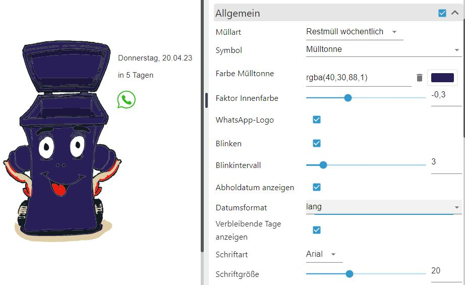
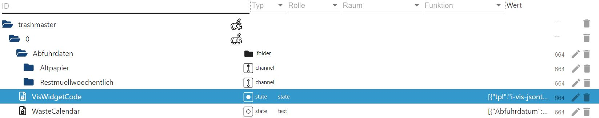
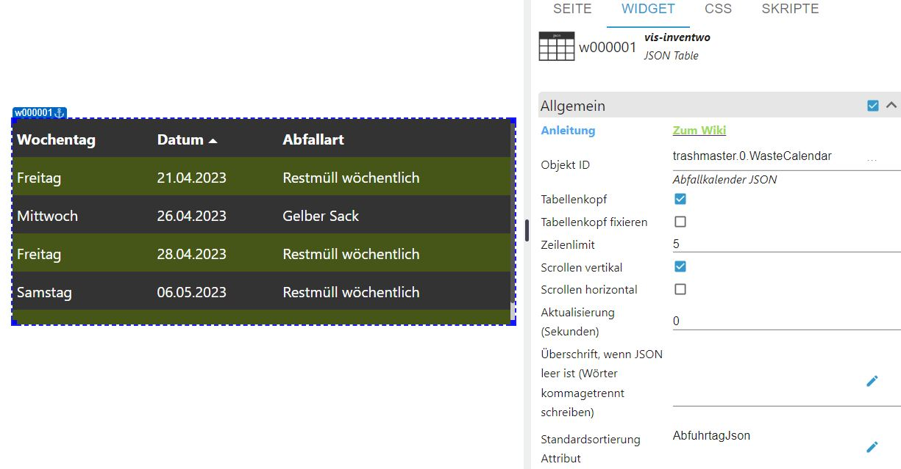
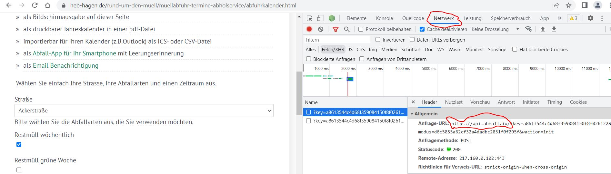

# ioBroker.trashmaster

## Abfallkalender für den ioBroker

[Englische Version](./../../README.md)

Der Adapter liest die Müllabfuhrtermine des Anbieters abfall.io aus, den verschiedene Städte oder Landkreise nutzen (z.B. [Hagen](https://www.heb-hagen.de/rund-um-den-muell/muellabfuhr-termine-abholservice/abfuhrkalender.html), [Ludwigshafen](https://www.ludwigshafen.de/wirtschaftsstark/wirtschaftsbetrieb-ludwigshafen-wbl/abfall-und-wertstoffe/abfall-und-wertstoffkalender-online) oder [Landkreis Tuttlingen](https://www.abfall-tuttlingen.de/Abfalltermine-APP/)). Die einzelnen Müllarten der Stadt können ausgewählt und z.B. in einem Kalender dargestellt werden. 

Wenn der [Whatsapp Adapter]( https://github.com/ioBroker/ioBroker.whatsapp-cmb) im ioBroker installiert ist, wird das automatische Versenden von Nachrichten vor der Abholung pro Abfallart unterstützt. Die Anzahl der Tage zum Versand der Nachricht vor der Abholung, kann  individuell für jede Abfallart eingestellt werden.

Der Adapter beinhaltet zwei Widgets für die [VIS 2 (!)](https://www.npmjs.com/package/iobroker.vis-2-beta?activeTab=readme). Es kann ein Kalender mit den konfigurierten Müllarten oder ein Icon mit verschiedenen Konfigurationsmöglichkeiten dargestellt werden. Das Icon kann x Tage vor der Abholung anfangen zu blinken, wenn das in den Adaptereinstellungen zur Abfallart konfiguriert ist 

 Sind [VIS](https://github.com/ioBroker/ioBroker.vis) oder [VIS 2 (!)](https://www.npmjs.com/package/iobroker.vis-2-beta?activeTab=readme) UND das Widget-Set [inventwo](https://github.com/inventwo/ioBroker.vis-inventwo) installiert, wird ein Datenpunkt erzeugt, der den Widget-Code für eine JSON-Tabelle beinhaltet.

**_Allgemeine Adaptereinstellungen:_**

**_Detaileinstellungen:_**

**_Beispiele Widgets:_** 

- *Kalender*

- *Icon (Mülltonne)*

- *Icon (Gelber Sack)*

- *Icon (Blatt)*

+ *VIS inventwo Widget (JSON Tabelle)*
>- *Datenpunkt mit Code für VIS inventwo Widget (JSON Tabelle)*

>- *VIS inventwo Widget (JSON Tabelle mit Daten aus dem Abfallkalender)*

**_Ist meine Stadt/mein Landkreis für den Adapter geeignet?:_**

Städte/Landkreise, die mit abfall.io. zusammenarbeiten, bieten auf ihren Internetseiten ähnliche Kalender an, wie du sie z.B. auf der Seite der [HEB Hagen](https://www.heb-hagen.de/rund-um-den-muell/) sehen kannst. Wenn die URL von deinem Entsorgungsunternehmen nicht vom Adapter akzeptiert wird, kannst du ggf. auf der Entsorgerseite mit dem Developertool deines Browsers prüfen, ob beim Auswählen der Stadt, Straße eine URL mit api.abfall.io (nicht apiv2.abfall.io !) aufgerufen wird. Hier ein Beispiel aus dem Chrome-Developertool (aufrufbar über die Funktionstaste F12 - dort dann Netzwerk auswählen und die Seite neu laden).

**_Sonstiges:_**

+  Der Adapter wird jede Nacht um 0:05 Uhr (+ eine Zufallsverzögerung, damit die API nicht parallel von zu vielen Anfragen gestört wird) neu gestartet, liest die Daten aus der API von abfall.io und aktualisiert die entsprechenden Datenpunkte im Objektverzeichnis der Adapterinstanz. Da sich ein Abfuhrkalendar in der Regel nicht häufig ändert, sollte dieses Intervall vollkommen ausreichen. Du kannst die Einstellung aber auch jederzeit in der Instanzeinstellung vom Abfallkalender in ioBroker ändern.

+ Bei Bedarf können mehrere Instanzen (für verschiedene Städte) installiert werden.

**_Liste einiger bekannter Städte / Landkreise:_**

+ [Breisgau-Hochschwarzwald Landkreis](https://www.breisgau-hochschwarzwald.de/pb/Breisgau-Hochschwarzwald/Start/Service+_+Verwaltung/Entsorgung+und+Recycling.html)
+ [Hagen (Stadt NRW)](https://www.heb-hagen.de/rund-um-den-muell/muellabfuhr-termine-abholservice/abfuhrkalender.html)
+ [Kaarst, Krefeld uvm. (Schönmackers)](https://www.schoenmackers.de/rund-um-service/muellalarm/)
+ [Limburg-Weilburg Landkreis](https://www.awb-lm.de/ihr-trashmaster/)
+ [Reutlingen (Kreis)](https://www.kreis-reutlingen.de/abfalltermine)
+ [Tuttlingen (Landkreis)](https://www.abfall-tuttlingen.de/Abfalltermine-APP/)
+ [Ostallgäu (Landkreis)](https://www.buerger-ostallgaeu.de/abfallwirtschaft/abfuhrkalender.html)
+ [Rotenburg (Wümme - Landkreis)](https://www.lk-awr.de/termine/entsorgungstermine/)
+ [Vorpommern-Rügen (Landkreis)](https://www.lk-vr.de/Abfallkalender)
+ [Waldshut (Landkreis)](https://www.abfall-landkreis-waldshut.de/de/termine/)
+ [Westerwald (Kreis)](https://wab.rlp.de/nc/abfuhr-termine/regelabfuhrtermine.html)					   

## Sentry
Dieser Adapter verwendet Sentry Bibliotheken um automatisch Ausnahmen und Code Fehler an die Entwickler zu melden. Für weitere Details und für Informationen wie man die Fehlerberichterstattung deaktivieren kann siehe [Sentry-Plugin Dokumentation](https://github.com/ioBroker/plugin-sentry#plugin-sentry). Sentry Reporting wird ab js-controller 3.0 verwendet.

## Lizenz

MIT Lizenz

Copyright (c) 2023 Formifan2002 <formifan2002@web.de>
